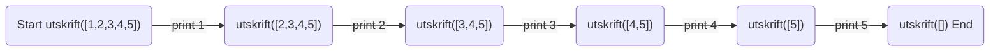
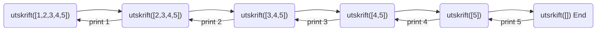

```mermaid
%%{init: {"flowchart": {"htmlLabels": false}} }%%
flowchart LR
    A("Start utskrift([1,2,3,4,5])") -->|print 1| B("utskrift([2,3,4,5])")
    B -->|print 2| C("utskrift([3,4,5])")
    C -->|print 3| D("utskrift([4,5])")
    D -->|print 4| E("utskrift([5])")
    E -->|print 5| F("utskrift([]) End")
```

```mermaid
%%{init: {"flowchart": {"htmlLabels": false}} }%%
flowchart LR
        A("utskrift([1,2,3,4,5])") -->B("utskrift([2,3,4,5])")
        B --> C("utskrift([3,4,5])")
        C --> D("utskrift([4,5])")
        D --> E("utskrift([5])")
        E --> F("utsrkift([]) End") 
        F -->|print 5|E
        E-->|print 4|D
        D-->|print 3|C
        C-->|print 2|B
        B-->|print 1|A
```
Vad finns det att förklara, vid tar bort första respektive sista värdet i listan medans vi loopar.

